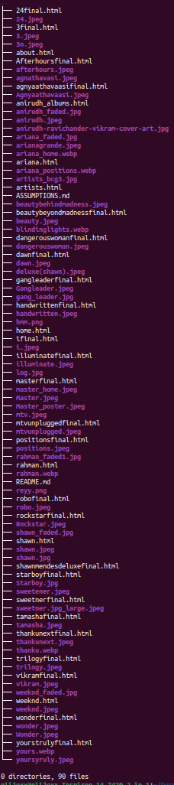

# Website Instructions

## Before You Start
1. **Organize Files**: Ensure all the submitted files are located in the same folder.
2. **Open the Website**: Locate the `home.html` file and open it in your web browser. This will be your entry point to navigate through the website.

## Navigation
- **Navigation Bar**: The nav bar, present on all pages, includes links to:
  - **Home Page**: Displays top charts for artists, albums, and songs.
  - **Artists Page**: Lists various artists and allows navigation to their albums.
  - **About Page**: Provides information about the website and its developers.

## Home Page
- **Top Charts**: View the top charts for artists, albums, and songs.
- **Navigation Links**: Click on artists or albums to view their respective pages.

## Artists Page
- **Artist List**: Displays a list of 5 different artists.
- **Album Navigation**: Click on an artist to navigate to their albums.

## Album Page
- **Album List**: Shows 5 albums of the selected artist.
- **Song Navigation**: Click on an album to view its songs.

## Songs Page
- **Song List**: Displays a list of songs from the selected album.

## Footer
- **Footer Content**: Each page includes a footer with:
  - **Website Logo**: A logo (wave icon).
  - **Developer Names**: Names of the website developers.
  - **Link to About Page**: Provides easy access to the About page.

## About Page
- **Description**: Contains a brief description of the website.
- **Developer Information**: Includes details about the developers.

## Website Structure

Enjoy exploring the website!
